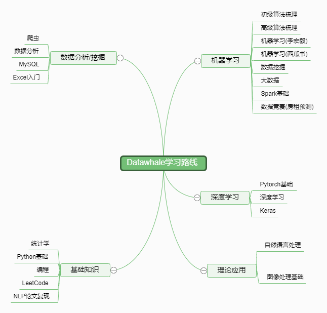

Datawhale_Learning涵盖了AI领域从理论知识到动手实践的学习内容

# 编程基础
## 课程列表
### 【编程】
**[课程简介](./编程基础/Programming/README.md)**

**任务安排**
- Task1：[数组+链表(2天)](./编程基础/Programming/学习任务/Task1.md)
- Task2：[栈+队列+递归(3天)](./编程基础/Programming/学习任务/Task2.md)
- Task3：[排序+二分查找(2天)](./编程基础/Programming/学习任务/Task3.md)
- Task4：[散列表（哈希表）+字符串(2天)](./编程基础/Programming/学习任务/Task4.md)
- Task5：[二叉树+堆(2天)](./编程基础/Programming/学习任务/Task5.md)
- Task6：[图(2天)](./编程基础/Programming/学习任务/Task6.md)
- Task7：[递归+回溯+分治+动态规划(2天)](./编程基础/Programming/学习任务/Task7.md)

### 【leetCode】

**[课程简介](./编程基础/leetCode/README.md)**

**任务安排**

选取腾讯精选练习（50 题）解答，每天1题

# 基础知识

## 课程列表
### 【统计学】

**[课程简介](./基础知识/Statistical/README.md)**

**任务安排**

- Task1：[统计学基本知识+二项及泊松分布+大数定律+正态分布(2天)](./基础知识/Statistical/学习任务/Task1.md)
- Task2：[中心极限定理+置信区间(1天)](./基础知识/Statistical/学习任务/Task2.md)
- Task3：[假设检验(2天)](./基础知识/Statistical/学习任务/Task3.md)
- Task4：[线性回归+卡方分布+方差分析(2天)](./基础知识/Statistical/学习任务/Task4.md)

### 【Python基础】
**[课程简介](./基础知识/Python/README.md)**

**任务安排**
- Task1：[环境搭建+python初体验+python基础讲解+ python数值基本知识(2天)](./基础知识/Python/学习任务/Task1.md)
- Task2：[列表+元组+string字符串+字符串格式化问题(2天)](./基础知识/Python/学习任务/Task2.md)
- Task3：[数组+集合+判断语句+三目表达式+循环语句(2天)](./基础知识/Python/学习任务/Task3.md)
- Task4：[数组+集合+判断语句+三目表达式+循环语句(2天)](./基础知识/Python/学习任务/Task4.md)
- Task5：[函数+file+os模块+ datetime模块(2天)](./基础知识/Python/学习任务/Task5.md)

# 数据科学
## 课程列表
### 【Excel入门】
**[课程简介](./数据科学/Excel/README.md)**

**任务安排**

- Task1：[基础界面+文件操作+基础单元格操作(3天)](数据科学/Excel/学习任务/Task1.md)
- Task2：[单元格引用+运算符+文本函数+逻辑函数+计算函数(2天)](数据科学/Excel/学习任务/Task2.md)
- Task3：[vlookup函数用法+match&index+双条件查找(2天)](数据科学/Excel/学习任务/Task3.md)
- Task4：[图表类型+图表类型选择指南+图表的构成要素(3天)](数据科学/Excel/学习任务/Task4.md)
- Task5：[数据透视表+实现数据分段统计+变更值汇总依据+设置三种值百分比+计算字段&计算项(2天)](数据科学/Excel/学习任务/Task5.md)

### 【数据分析】
**[课程简介](./数据科学/Data_Analysis/README.md)**

**任务安排**
- Task0：[github+jupyter(1天)](数据科学/Data_Analysis/学习任务/Task0.md)
- Task1：[第4章numpy+作业1(2天)](数据科学/Data_Analysis/学习任务/Task1.md)
- Task2：[第5章pandas+第6章数据载入(3天)](数据科学/Data_Analysis/学习任务/Task2.md)
- Task3：[第7章数据清洗+第8章数据联合(3天)](数据科学/Data_Analysis/学习任务/Task3.md)
- Task4：[第10章数据聚合+第12章高阶pandas+作业2(3天)](数据科学/Data_Analysis/学习任务/Task4.md)
- Task5：[第9章matplotlib+作业3(2天)](数据科学/Data_Analysis/学习任务/Task5.md)
- Task6：[第11章时间序列(2天)](数据科学/Data_Analysis/学习任务/Task6.md)
- Task7：[大作业+总结(3天)](数据科学/Data_Analysis/学习任务/Task7.md)

### 【MySQL】

**[课程简介](./数据科学/MYSQL/README.md)**

**任务安排**
- Task1：[软件安装及数据库基础+MySQL 基础 （一）- 查询语句(3天)](数据科学/MYSQL/学习任务/Task1.md)
- Task2：[MySQL 基础 （二）- 表操作(3天)](数据科学/MYSQL/学习任务/Task2.md)
- Task3：[MySQL 实战(1天)](数据科学/MYSQL/学习任务/Task3.md)
- Task4：[MySQL 实战 - 复杂项目(1天)](数据科学/MYSQL/学习任务/Task4.md)

### 【爬虫】
**[课程简介](./数据科学/Scrapy/README.md)**

**任务安排**
- Task1：[get与post请求+正则表达式(2天)](./数据科学/Scrapy/学习任务/Task1.md)
- Task2：[beautifulsoup+xpath(2天)](./数据科学/Scrapy/学习任务/Task2.md)
- Task3：[selenium+IP(2天)](./数据科学/Scrapy/学习任务/Task3.md)
- Task4：[实战大项目(2天)](./数据科学/Scrapy/学习任务/Task4.md)
# 机器学习
## 课程列表
### 【初级算法梳理】

**[课程简介](./机器学习/Primary-algorithm-combing/README.md)**

**任务安排**
- Task1：[线性回归算法梳理(2天)](./机器学习/Primary-algorithm-combing/学习任务/Task1.md)
- Task2：[逻辑回归算法梳理(2天)](./机器学习/Primary-algorithm-combing/学习任务/Task2.md)
- Task3：[决策树算法梳理(2天)](./机器学习/Primary-algorithm-combing/学习任务/Task3.md)

### 【高级算法梳理】 

**[课程简介](./机器学习/Advanced-algorithm-combing/README.md)**

**任务安排**
- Task1：[随机森林算法梳理(2天)](./机器学习/Advanced-algorithm-combing/学习任务/Task1.md)
- Task2：[GBDT算法梳理(2天)](./机器学习/Advanced-algorithm-combing/学习任务/Task2.md)
- Task3：[XGB算法梳理(3天)](./机器学习/Advanced-algorithm-combing/学习任务/Task3.md)
- Task4：[LightGBM算法梳理(3天)](./机器学习/Advanced-algorithm-combing/学习任务/Task4.md)

### 【李宏毅机器学习(待完善)】：

**[课程简介](./机器学习/李宏毅机器学习/README.md)**

**任务安排**
- Task1：
- Task2：
- Task3：
- Task4：
- Task5：
- Task6：
- Task7：
- Task8：
- Task9：
- Task10：

### 【西瓜书(待完善)】

**[课程简介](./机器学习/西瓜书/README.md)**

**任务安排**
- Task1：
- Task2：
- Task3：
- Task4：
- Task5：
- Task6：
- Task7：
- Task8：
- Task9：
- Task10：

### 数据竞赛(房租预测)
**[课程简介](./机器学习/数据竞赛(房租预测)/README.md)**

**[课程说明](./机器学习/数据竞赛(房租预测)/课程说明.md)**

**任务安排**
- Task1：[赛题分析(2天)](./机器学习/数据竞赛(房租预测)/Task1.md)
- Task2：[数据清洗(2天)](./机器学习/数据竞赛(房租预测)/Task2.md)
- Task3：[特征工程(2天)](./机器学习/数据竞赛(房租预测)/Task3.md)
- Task4：[模型选择(2天)](./机器学习/数据竞赛(房租预测)/Task4.md)
- Task5：[模型融合(2天)](./机器学习/数据竞赛(房租预测)/Task5.md)
- Task6：[比赛整理(2天)](./机器学习/数据竞赛(房租预测)/Task6.md)

# 深度学习
## 课程列表
### 【Pytorch基础】
**[课程简介](./深度学习/Pytorch/README.md)**

**任务安排**
- Task1：[PyTorch的基本概念(2天)](深度学习/Pytorch/学习任务/Task1.md)
- Task2：[设立计算图并自动计算(2天)](深度学习/Pytorch/学习任务/Task2.md)
- Task3：[PyTorch实现Logistic regression(2天)](深度学习/Pytorch/学习任务/Task3.md)
- Task4：[PyTorch实现多层网络(2天)](深度学习/Pytorch/学习任务/Task4.md)
- Task5：[PyTorch实现L1，L2正则化以及Dropout(2天)](深度学习/Pytorch/学习任务/Task5.md)
- Task6：[PyTorch理解更多神经网络优化方法(2天)](深度学习/Pytorch/学习任务/Task6.md)
- Task7：[手写数字识别(2天)](深度学习/Pytorch/学习任务/Task7.md)

# 理论应用
## 课程列表
### 【数据挖据】 
**[课程简介](理论应用/数据挖掘/README.md)**

**任务安排**
- Task1：[数据分析(2天)](理论应用/数据挖掘/学习任务/Task1.md)
- Task2：[特征工程(2天)](理论应用/数据挖掘/学习任务/Task2.md)
- Task3：[模型构建 (2天)](理论应用/数据挖掘/学习任务/Task3.md)
- Task4：[模型评估(2天)](理论应用/数据挖掘/学习任务/Task4.md)
- Task5：[模型调优(2天)](理论应用/数据挖掘/学习任务/Task5.md)
- Task6：[模型融合(2天)](理论应用/数据挖掘/学习任务/Task6.md)

### 【自然语言处理(理论+实践)】
**[课程简介](./理论应用/自然语言处理(理论+实践)/README.md)**

**任务安排**
- 预备任务：[tensorflow安装+tensrflow基础+NLP](./理论应用/自然语言处理(理论+实践)/学习任务/预备任务.md)
- Task1：[数据集探索(2天)](./理论应用/自然语言处理(理论+实践)/学习任务/Task1.md)
- Task2：[特征提取(2天)](./理论应用/自然语言处理(理论+实践)/学习任务/Task2.md)
- Task3：[特征选择 (2天)](./理论应用/自然语言处理(理论+实践)/学习任务/Task3.md)
- Task4：[模型 (2天)](./理论应用/自然语言处理(理论+实践)/学习任务/Task4.md)
- Task5：[文本表示(2天)](./理论应用/自然语言处理(理论+实践)/学习任务/Task5.md)
- Task6：[神经网络基础(2天)](./理论应用/自然语言处理(理论+实践)/学习任务/Task6.md)
- Task7：[卷积神经网络(2天)](./理论应用/自然语言处理(理论+实践)/学习任务/Task7.md)
- Task8：[循环和递归神经网络(2天)](./理论应用/自然语言处理(理论+实践)/学习任务/Task8.md)
- Task9：[Attention原理(2天)](./理论应用/自然语言处理(理论+实践)/学习任务/Task9.md)
- Task10：[BERT(3天)](./理论应用/自然语言处理(理论+实践)/学习任务/Task10.md)

### 【论文复现】

**[课程简介](./基础知识/NLP论文复现/README.md)**
    
 ### 【Spark基础】
 
**[课程简介](./机器学习/Spark基础/README.md)**
 
 **任务安排**

 - Task1：[运行原理，RDD设计，DAG，安装与使用(3天)](./机器学习/Spark基础/学习任务/Task1.md)
 - Task2：[RDD编程，熟悉算子，读写文件(3天)](./机器学习/Spark基础/学习任务/Task2.md)
 - Task3：[DataFrame,SparkSQL (2天)](./机器学习/Spark基础/学习任务/Task3.md)
 - Task4：[MLlib流设计，特征工程 (2天)](./机器学习/Spark基础/学习任务/Task4.md)
 - Task5：[逻辑回归，决策树(2天)](./机器学习/Spark基础/学习任务/Task5.md)

