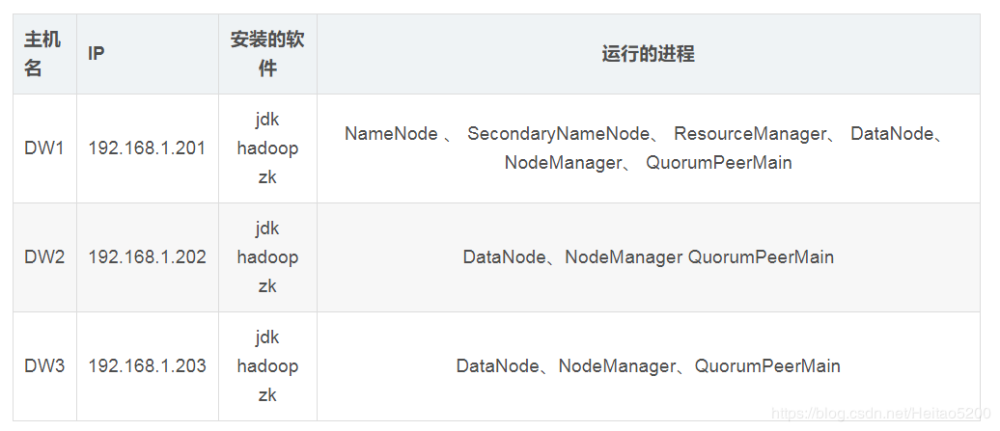
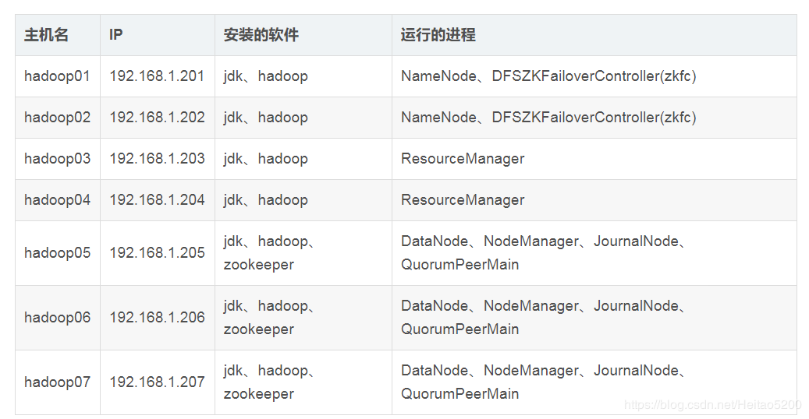

# 【Task 2】搭建Hadoop集群(3day)
## 原理部分
1. 阅读Google三大论文，并总结
2. 理解分布式文件系统的设计目标/原理
3. 理解MapReduce的执行原理
4. Yarn在Hadoop中的作用
5. Hadoop的作用（解决了什么问题）/运行模式/基础组件及架构 
6. 总结Hadoop中各个组件的通信方式，RPC/Http等（Client/NameNode/DataNode）

## 实践部分
1. 搭建Hadoop集群并验证，3节点(1主2从)，理解高可用HA/Federation,并截图记录搭建过程，建议在搭建集群的过程中，每进行一步，都check下这个步骤是否生效了。
2. 学会写WordCount（Java/Python-Hadoop Streaming），理解分布式/单机运行模式的区别

参考资料：
[Google三大论文](https://blog.csdn.net/w1573007/article/details/52966742)

集群规划1-省机器：

集群规划2-清晰：

